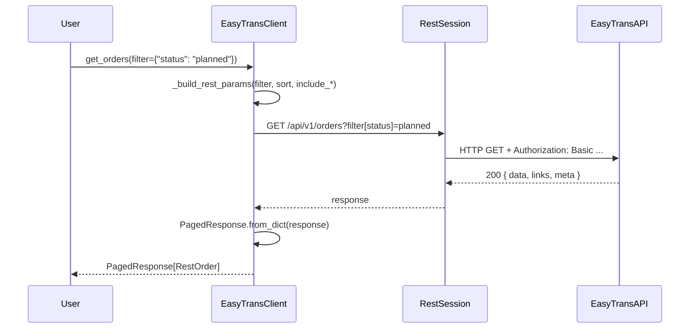

# EasyTrans REST API Integration Plan

## Executive Summary

The existing SDK already supports two JSON import endpoints: `import_orders()` and `import_customers()`, which POST to the proprietary `import_json.php` endpoint with credentials embedded in the JSON body.

The REST API (`/api/v1/`) is a **second, separate API** on the same server with:
- **Different authentication**: HTTP Basic Auth (`Authorization: Basic base64(user:pass)`) instead of credentials in body
- **Different base URL**: `https://{server}/{environment}/api/v1/` instead of `import_json.php`
- **Standard REST verbs**: GET / PUT
- **JSON:API-style responses**: `{ data, links, meta }` wrappers with pagination

The goal is a **single, unified `EasyTransClient`** where users never need to know about the two backing APIs.

---

## Current vs Target State

```
CURRENT                             TARGET
─────────────────────────────────── ─────────────────────────────────────
EasyTransClient                     EasyTransClient
  .import_orders()   → POST JSON      .import_orders()     → POST JSON
  .import_customers()→ POST JSON      .import_customers()  → POST JSON
  .parse_webhook()   (static)         .parse_webhook()     (static)
                                      .get_orders()        → GET  REST
                                      .get_order()         → GET  REST
                                      .update_order()      → PUT  REST
                                      .get_customers()     → GET  REST
                                      .get_customer()      → GET  REST
                                      .get_carriers()      → GET  REST
                                      .get_carrier()       → GET  REST
                                      .get_fleet()         → GET  REST
                                      .get_fleet_vehicle() → GET  REST
                                      .get_products()      → GET  REST
                                      .get_product()       → GET  REST
                                      .get_substatuses()   → GET  REST
                                      .get_substatus()     → GET  REST
                                      .get_package_types() → GET  REST
                                      .get_package_type()  → GET  REST
                                      .get_vehicle_types() → GET  REST
                                      .get_vehicle_type()  → GET  REST
                                      .get_invoices()      → GET  REST
                                      .get_invoice()       → GET  REST
                                      .get_carrier_orders()→ GET  REST (*)
                                      .get_carrier_order() → GET  REST (*)
                                      .update_carrier_order()→PUT REST (*)
(*) carrier account only
```

---

## API Inventory

All paths below are relative to `https://{server}/{environment}/api/v1/`.

| Tag | Method | Path | Summary |
|-----|--------|------|---------|
| Orders | GET | `/v1/orders` | List orders |
| Orders | GET | `/v1/orders/{orderNo}` | Get single order |
| Orders | PUT | `/v1/orders/{orderNo}` | Update order (branch only) |
| Products | GET | `/v1/products` | List products |
| Products | GET | `/v1/products/{productNo}` | Get product |
| Substatuses | GET | `/v1/substatuses` | List substatuses |
| Substatuses | GET | `/v1/substatuses/{substatusNo}` | Get substatus |
| PackageTypes | GET | `/v1/packagetypes` | List package types |
| PackageTypes | GET | `/v1/packagetypes/{packageTypeNo}` | Get package type |
| VehicleTypes | GET | `/v1/vehicletypes` | List vehicle types |
| VehicleTypes | GET | `/v1/vehicletypes/{vehicleTypeNo}` | Get vehicle type |
| Invoices | GET | `/v1/invoices` | List invoices |
| Invoices | GET | `/v1/invoices/{invoiceId}` | Get invoice |
| Customers | GET | `/v1/customers` | List customers (branch only) |
| Customers | GET | `/v1/customers/{customerNo}` | Get customer (branch only) |
| Carriers | GET | `/v1/carriers` | List carriers (branch only) |
| Carriers | GET | `/v1/carriers/{carrierNo}` | Get carrier (branch only) |
| Fleet | GET | `/v1/fleet` | List fleet vehicles (branch only) |
| Fleet | GET | `/v1/fleet/{fleetNo}` | Get fleet vehicle (branch only) |
| Carrier Orders | GET | `/v1/carrier/orders` | List orders (carrier only) |
| Carrier Orders | GET | `/v1/carrier/orders/{orderNo}` | Get order (carrier only) |
| Carrier Orders | PUT | `/v1/carrier/orders/{orderNo}` | Update order (carrier only) |

---

## Architecture

### API differences requiring separate session / transport

| Aspect | JSON Import (existing) | REST API (new) |
|--------|----------------------|----------------|
| Base URL | `https://{server}/{env}/import_json.php` | `https://{server}/{env}/api/v1` |
| HTTP Method | POST | GET / PUT |
| Auth | JSON body `{ authentication: { username, password } }` | `Authorization: Basic <b64>` header |
| Error signal | HTTP 200 + `{ "error": {...} }` in body | HTTP 4xx status codes |
| Response | `{ "result": {...} }` | `{ "data": ..., "links": ..., "meta": ... }` |

The client will hold **two sessions**: one for the JSON import API (existing `self.session`) and one for the REST API (`self._rest_session`). Both share the same `server_url`, `environment_name`, `username`, and `password` constructor arguments — zero extra config required.

### URL construction

```python
# Existing (unchanged)
self.base_url = f"https://{server_url}/{environment_name}/import_json.php"

# New
self._rest_base_url = f"https://{server_url}/{environment_name}/api/v1"
```

### Authentication setup

```python
import base64, requests

creds = base64.b64encode(f"{username}:{password}".encode()).decode()
self._rest_session = requests.Session()
self._rest_session.headers.update({
    "Authorization": f"Basic {creds}",
    "Accept": "application/json",
})
self._rest_session.verify = verify_ssl
```

---

## Files to Create / Modify

```
easytrans/
  exceptions.py        MODIFY — add EasyTransNotFoundError, EasyTransRateLimitError
  rest_models.py       CREATE — all REST response dataclasses
  client.py            MODIFY — REST transport layer + 22 new API methods
  constants.py         MODIFY — add RestOrderStatus, TaskType enums
  __init__.py          MODIFY — export new symbols

tests/
  test_rest_models.py        CREATE — unit tests for REST model de/serialisation
  test_rest_client.py        CREATE — unit tests with mocked REST responses
  integration/
    test_rest_orders.py      CREATE — integration tests for order REST endpoints
    test_rest_reference.py   CREATE — integration tests for products/substatuses/packagetypes/vehicletypes
    test_rest_customers.py   CREATE — integration tests for customers/carriers/fleet
    test_rest_invoices.py    CREATE — integration tests for invoices
    test_rest_carrier.py     CREATE — integration tests for carrier order endpoints

.env.example           MODIFY — add REST API test variables
README.md              MODIFY — add REST API usage section
```

---

## Phase 1 — Exceptions (`easytrans/exceptions.py`)

Add two new exception classes to the bottom of the existing hierarchy:

```python
class EasyTransNotFoundError(EasyTransAPIError):
    """404 — The requested resource does not exist."""

class EasyTransRateLimitError(EasyTransAPIError):
    """429 — Rate limit exceeded (max 60 requests per minute)."""
```

---

## Phase 2 — REST Models (`easytrans/rest_models.py`)

All models are `@dataclass` with `from_dict()` class-methods (no `to_dict()` needed as these are read-only responses).

### Pagination models

```python
@dataclass
class PaginationLinks:
    first: Optional[str]
    last: Optional[str]
    prev: Optional[str]
    next: Optional[str]

@dataclass
class PaginationMeta:
    current_page: int
    last_page: int
    per_page: int
    total: int
    from_: Optional[int]      # 'from' is a reserved keyword
    to: Optional[int]
```

### Generic list response wrapper

```python
@dataclass
class PagedResponse(Generic[T]):
    data: List[T]
    links: PaginationLinks
    meta: PaginationMeta
    has_next: bool            # convenience: bool(links.next)
```

### Core entity models (mirror OpenAPI schemas)

#### `RestAddress`
Fields: `address`, `houseno`, `address2`, `postcode`, `city`, `country`

#### `RestMailingAddress` (extends RestAddress)
Additional: `attn`

#### `RestLocation`
Fields: `latitude`, `longitude`

#### `RestDestination`
Fields: `addressId`, `stopNo`, `taskType` (pickup/delivery), `company`, `contact`, `address`, `houseno`, `address2`, `postcode`, `city`, `country`, `location`, `phone`, `notes`, `customerReference`, `waybillNo`, `date`, `fromTime`, `toTime`, `eta`, `deliveryDate`, `deliveryTime`, `departureTime`, `deliveryName`, `signatureUrl`, `photos`, `documents`, `carrierNotes`

#### `RestGoodsLine`
Fields: `packageId`, `packageNo`, `pickupDestination`, `deliveryDestination`, `amount`, `packageTypeNo`, `packageTypeName`, `weight`, `length`, `width`, `height`, `description`

#### `RestRate`
Fields: `rateNo`, `description`, `ratePerUnit`, `subTotal`, `isMinimumAmount`, `isPercentage`

#### `RestTrackHistoryEntry`
Fields: `trackId`, `name`, `location`, `date`, `time`

#### `RestCustomerContact`
Fields: `userId`, `contactNo`, `salutation`, `name`, `phone`, `mobile`, `email`, `useEmailForInvoice`, `useEmailForReminder`, `notes`, `username`

#### `RestCustomer`
Top-level: `type`, `id`, `createdAt`, `updatedAt`
`attributes` sub-object containing all address/financial/contact fields (matches OpenAPI `Customer` schema)

#### `RestCarrierContact`
Fields: `userId`, `name`, `phone`, `mobile`, `email`, `notes`, `username`

#### `RestCarrier`
Top-level: `type`, `id`, `createdAt`, `updatedAt`  
`attributes` sub-object (matches OpenAPI `Carrier` schema)

#### `RestOrderAttributes`
All fields from `OrderAttributes` schema: `orderNo`, `date`, `time`, `status`, `substatusNo`, `substatusName`, `collected`, `productNo`, `productName`, `customerNo`, `customerUserId`, `carrierNo`, `carrierUserId`, `branchNo`, `vehicleTypeNo`, `vehicleTypeName`, `fleetNo`, `waybillNotes`, `invoiceNotes`, `purchaseInvoiceNotes`, `internalNotes`, `recipientEmail`, `distance`, `orderPrice`, `orderPurchasePrice`, `prepaidAmount`, `readyForPurchaseInvoice`, `usernameCreated`, `usernameAssigned`, `invoiceId`, `trackingId`, `externalId`, `isDeleted` + embedded: `destinations`, `goods`, `customer`, `carrier`, `salesRates`, `purchaseRates`, `trackHistory`

#### `RestOrder`
Fields: `type`, `id`, `createdAt`, `updatedAt`, `attributes: RestOrderAttributes`

#### `RestProduct`
Fields: `type`, `id`, `attributes.productNo`, `attributes.name`, `attributes.isDeleted`

#### `RestSubstatus`
Fields: `type`, `id`, `attributes.substatusNo`, `attributes.name`, `attributes.isDeleted`

#### `RestPackageType`
Fields: `type`, `id`, `attributes.packageTypeNo`, `attributes.name`, `attributes.isDeleted`

#### `RestVehicleType`
Fields: `type`, `id`, `attributes.vehicleTypeNo`, `attributes.name`, `attributes.isDeleted`

#### `RestFleetVehicle`
Fields: `type`, `id`, `attributes.fleetNo`, `attributes.name`, `attributes.licensePlate`, `attributes.vehicleTypeNo`, `attributes.active`, `attributes.isDeleted`

#### `RestInvoice`
Fields: `type`, `id`, `attributes`: `invoiceId`, `invoiceNo`, `invoiceDate`, `customerNo`, `totalAmount`, `vatAmount`, `paymentMethod`, `onlinePaymentStatus`, `discountPercentage`, `sentDate`, `paid`, `paidDate`, `exported`, `externalId`, `invoicePdf` (optional base64), `customer` (optional embedded)

---

## Phase 3 — REST Transport Layer (`easytrans/client.py`)

### New `__init__` additions

```python
# Construct REST base URL
self._rest_base_url = f"https://{server_url}/{environment_name}/api/v1"

# Create REST session with Basic Auth pre-configured
import base64
_creds = base64.b64encode(f"{username}:{password}".encode()).decode()
self._rest_session = requests.Session()
self._rest_session.headers.update({
    "Authorization": f"Basic {_creds}",
    "Accept": "application/json",
})
self._rest_session.verify = verify_ssl
```

### New private method: `_make_rest_request()`

```python
def _make_rest_request(
    self,
    method: str,               # "GET" or "PUT"
    path: str,                 # e.g. "/orders" or "/orders/35558"
    params: Optional[Dict] = None,
    json_body: Optional[Dict] = None,
) -> Any:
```

HTTP error mapping for REST:
- `401` → `EasyTransAuthError`
- `404` → `EasyTransNotFoundError`
- `422` → `EasyTransValidationError` (body contains `{ errors: {...} }`)
- `429` → `EasyTransRateLimitError`
- `5xx` → `EasyTransAPIError`

### New private method: `_iter_pages()`

```python
def _iter_pages(
    self,
    path: str,
    params: Dict,
    model_cls: Type[T],
) -> Iterator[T]:
    """Yield all items across all pages, following links.next."""
```

This enables a `get_all_orders()` convenience pattern while keeping individual page methods clean.

### Updated `close()` and `__exit__()`

Close both `self.session` and `self._rest_session`.

---

## Phase 4–8 — Public REST Methods

### Orders (branch + customer accounts)

```python
def get_orders(
    self,
    *,
    filter: Optional[Dict[str, Any]] = None,
    sort: Optional[str] = None,
    include_customer: bool = False,
    include_carrier: bool = False,
    include_track_history: bool = False,
    include_sales_rates: bool = False,
    include_purchase_rates: bool = False,
    include_deleted: bool = False,
    page: Optional[int] = None,
) -> PagedResponse[RestOrder]:

def get_order(
    self,
    order_no: int,
    *,
    include_customer: bool = False,
    include_carrier: bool = False,
    include_track_history: bool = False,
    include_sales_rates: bool = False,
    include_purchase_rates: bool = False,
    include_deleted: bool = False,
) -> RestOrder:

def update_order(
    self,
    order_no: int,
    *,
    carrier_no: Optional[int] = None,
    fleet_no: Optional[int] = None,
    waybill_notes: Optional[str] = None,
    invoice_notes: Optional[str] = None,
    purchase_invoice_notes: Optional[str] = None,
    internal_notes: Optional[str] = None,
    ready_for_purchase_invoice: Optional[bool] = None,
    external_id: Optional[str] = None,
    destinations: Optional[List[Dict]] = None,
    goods: Optional[List[Dict]] = None,
    sales_rates: Optional[List[Dict]] = None,
    purchase_rates: Optional[List[Dict]] = None,
) -> RestOrder:
```

**Filter helper for `get_orders()`:**  
The OpenAPI spec uses `filter[orderNo]`, `filter[date][gte]` style keys. The SDK maps a nested dict like `{"date": {"gte": "2024-01-01"}}` to `filter[date][gte]=2024-01-01` query params, OR it accepts flat strings for simple cases.

### Reference data (all read-only)

```python
def get_products(self, *, filter_name: Optional[str] = None, include_deleted: bool = False) -> PagedResponse[RestProduct]
def get_product(self, product_no: int, *, include_deleted: bool = False) -> RestProduct

def get_substatuses(self, *, filter_name: Optional[str] = None, include_deleted: bool = False) -> PagedResponse[RestSubstatus]
def get_substatus(self, substatus_no: int, *, include_deleted: bool = False) -> RestSubstatus

def get_package_types(self, *, filter_name: Optional[str] = None, include_deleted: bool = False) -> PagedResponse[RestPackageType]
def get_package_type(self, package_type_no: int, *, include_deleted: bool = False) -> RestPackageType

def get_vehicle_types(self, *, filter_name: Optional[str] = None, include_deleted: bool = False) -> PagedResponse[RestVehicleType]
def get_vehicle_type(self, vehicle_type_no: int, *, include_deleted: bool = False) -> RestVehicleType
```

### Customers & carriers (branch only)

```python
def get_customers(self, *, filter: Optional[Dict] = None, sort: Optional[str] = None, include_deleted: bool = False, page: Optional[int] = None) -> PagedResponse[RestCustomer]
def get_customer(self, customer_no: int, *, include_deleted: bool = False) -> RestCustomer

def get_carriers(self, *, filter: Optional[Dict] = None, sort: Optional[str] = None, include_deleted: bool = False, page: Optional[int] = None) -> PagedResponse[RestCarrier]
def get_carrier(self, carrier_no: int, *, include_deleted: bool = False) -> RestCarrier

def get_fleet(self, *, filter_registration: Optional[str] = None, include_deleted: bool = False) -> PagedResponse[RestFleetVehicle]
def get_fleet_vehicle(self, fleet_no: int, *, include_deleted: bool = False) -> RestFleetVehicle
```

### Invoices

```python
def get_invoices(self, *, filter: Optional[Dict] = None, include_customer: bool = False, include_invoice_pdf: bool = False, page: Optional[int] = None) -> PagedResponse[RestInvoice]
def get_invoice(self, invoice_id: int, *, include_customer: bool = False, include_invoice_pdf: bool = False) -> RestInvoice
```

### Carrier account orders

```python
def get_carrier_orders(self, *, filter: Optional[Dict] = None, sort: Optional[str] = None, page: Optional[int] = None) -> PagedResponse[RestOrder]
def get_carrier_order(self, order_no: int) -> RestOrder
def update_carrier_order(self, order_no: int, *, status: Optional[str] = None, destinations: Optional[List[Dict]] = None) -> RestOrder
```

---

## Phase 9 — `__init__.py` Exports

Add to `__all__` and imports:

```python
from easytrans.rest_models import (
    RestOrder, RestOrderAttributes,
    RestCustomer, RestCustomerContact,
    RestCarrier, RestCarrierContact,
    RestInvoice, RestProduct, RestSubstatus,
    RestPackageType, RestVehicleType, RestFleetVehicle,
    RestDestination, RestGoodsLine, RestRate,
    RestTrackHistoryEntry, RestLocation,
    PagedResponse, PaginationLinks, PaginationMeta,
)
from easytrans.exceptions import (
    ...,
    EasyTransNotFoundError,
    EasyTransRateLimitError,
)
```

---

## Phase 10 — `constants.py` Additions

```python
class RestOrderStatus(str, Enum):
    """Order status values returned by REST API."""
    QUOTE = "quote"
    SAVED_WEBORDER = "saved-weborder"
    PENDING_ACCEPTATION = "pending-acceptation"
    IN_PROGRESS = "in-progress"
    FINISHED = "finished"
    OPEN = "open"
    PLANNED = "planned"
    SIGNED_OFF = "signed-off"
    CHECKED = "checked"
    INVOICED = "invoiced"


class TaskType(str, Enum):
    """Destination task type in REST API."""
    PICKUP = "pickup"
    DELIVERY = "delivery"
```

---

## Phase 11–12 — Unit Tests (no real API calls)

### `tests/test_rest_models.py`

- `test_paged_response_from_dict_orders()` — round-trip OrderListResponse fixture
- `test_rest_order_full_attributes()` — all fields including embedded customer/carrier/rates/track
- `test_rest_customer_from_dict()` — full Customer schema
- `test_rest_carrier_from_dict()` — full Carrier schema
- `test_rest_invoice_from_dict()` — with and without embedded customer
- `test_pagination_links_next()` — `has_next` is True when `links.next` present
- `test_pagination_links_no_next()` — `has_next` is False on last page
- `test_rest_product_from_dict()`
- `test_rest_substatus_from_dict()`
- `test_rest_package_type_from_dict()`
- `test_rest_vehicle_type_from_dict()`
- `test_rest_fleet_vehicle_from_dict()`

### `tests/test_rest_client.py` (uses `responses` library for HTTP mocking)

- `test_get_orders_returns_paged_response()` — verifies correct URL, Basic Auth header, and model parsing
- `test_get_order_single()` — verifies `/v1/orders/35558`
- `test_update_order_puts_body()` — verifies PUT with correct JSON body
- `test_get_orders_filter_params()` — verify `filter[date][gte]` query string construction
- `test_get_orders_include_flags()` — verify `include_customer=true` in query params
- `test_rest_401_raises_auth_error()` — HTTP 401 → `EasyTransAuthError`
- `test_rest_404_raises_not_found()` — HTTP 404 → `EasyTransNotFoundError`
- `test_rest_422_raises_validation_error()` — HTTP 422 → `EasyTransValidationError`
- `test_rest_429_raises_rate_limit_error()` — HTTP 429 → `EasyTransRateLimitError`
- `test_get_products_list()`
- `test_get_substatuses_list()`
- `test_get_invoices_with_pdf()`
- `test_iter_pages_follows_next_link()` — pagination auto-follow

---

## Phase 13–16 — Integration Tests

All integration tests use `@pytest.mark.integration` and require `.env`.

### `tests/integration/test_rest_orders.py`

```python
def test_get_orders_returns_results(rest_client):
    response = rest_client.get_orders()
    assert isinstance(response, PagedResponse)
    assert len(response.data) >= 0

def test_get_orders_filter_by_status(rest_client):
    response = rest_client.get_orders(filter={"status": "planned"})
    for order in response.data:
        assert order.attributes.status == "planned"

def test_get_orders_sort_descending(rest_client, known_order_no):
    response = rest_client.get_orders(sort="-orderNo")
    assert response.data[0].id >= response.data[-1].id

def test_get_single_order(rest_client, known_order_no):
    order = rest_client.get_order(known_order_no)
    assert order.attributes.orderNo == known_order_no

def test_get_order_with_track_history(rest_client, known_order_no):
    order = rest_client.get_order(known_order_no, include_track_history=True)
    assert order.attributes.trackHistory is not None

def test_get_order_not_found_raises(rest_client):
    with pytest.raises(EasyTransNotFoundError):
        rest_client.get_order(999999999)
```

### `tests/integration/test_rest_reference.py`

```python
def test_get_products(rest_client): ...
def test_get_product_by_number(rest_client, known_product_no): ...
def test_get_substatuses(rest_client): ...
def test_get_substatus_by_number(rest_client, known_substatus_no): ...
def test_get_package_types(rest_client): ...
def test_get_package_type_by_number(rest_client, known_package_type_no): ...
def test_get_vehicle_types(rest_client): ...
def test_get_vehicle_type_by_number(rest_client, known_vehicle_type_no): ...
```

### `tests/integration/test_rest_customers.py`

```python
def test_get_customers(rest_client): ...
def test_get_customers_filter_company(rest_client): ...
def test_get_customer_by_number(rest_client, known_customer_no): ...
def test_get_carriers(rest_client): ...
def test_get_carrier_by_number(rest_client, known_carrier_no): ...
def test_get_fleet(rest_client): ...
def test_get_fleet_vehicle(rest_client, known_fleet_no): ...
```

### `tests/integration/test_rest_invoices.py`

```python
def test_get_invoices(rest_client): ...
def test_get_invoice_by_id(rest_client, known_invoice_id): ...
def test_get_invoice_with_pdf(rest_client, known_invoice_id): ...
```

### `tests/integration/test_rest_carrier.py`

```python
def test_get_carrier_orders(carrier_client): ...
def test_get_carrier_order(carrier_client, known_order_no): ...
```

### Fixtures in `tests/integration/conftest.py`

Add `rest_client` fixture (re-uses existing credentials + constructs client) and new env-var based `known_order_no`, `known_product_no`, etc. fixtures.

---

## Phase 17 — `.env.example` Additions

```bash
# ── REST API tests ────────────────────────────────────────────────────────────
# Known entity numbers for look-up tests (leave blank to skip those tests).
EASYTRANS_REST_KNOWN_ORDER_NO=
EASYTRANS_REST_KNOWN_PRODUCT_NO=
EASYTRANS_REST_KNOWN_SUBSTATUS_NO=
EASYTRANS_REST_KNOWN_PACKAGE_TYPE_NO=
EASYTRANS_REST_KNOWN_VEHICLE_TYPE_NO=
EASYTRANS_REST_KNOWN_CUSTOMER_NO=
EASYTRANS_REST_KNOWN_CARRIER_NO=
EASYTRANS_REST_KNOWN_FLEET_NO=
EASYTRANS_REST_KNOWN_INVOICE_ID=

# ── Carrier account credentials (optional) ────────────────────────────────────
# Only needed to test the /v1/carrier/orders endpoints.
EASYTRANS_CARRIER_USERNAME=
EASYTRANS_CARRIER_PASSWORD=
```

**Note**: The existing `EASYTRANS_SERVER`, `EASYTRANS_ENV`, `EASYTRANS_USERNAME`, `EASYTRANS_PASSWORD` variables are **reused** automatically — no separate REST credentials needed unless the user has carrier-specific accounts.

---

## Phase 18 — README.md Updates

Add a **REST API** section after the existing JSON import section covering:

1. Reading orders with filtering/sorting/pagination
2. Fetching reference data (products, vehicle types, etc.)
3. Updating an order (branch accounts)
4. Reading invoices with PDF
5. Carrier account usage
6. Pagination iteration example

---

## Implementation Sequence Diagram



---

## Key Design Principles

1. **Zero extra config**: Same 4 constructor params (`server_url`, `environment_name`, `username`, `password`). REST API just uses them differently internally.

2. **All-keyword args for optional parameters**: Prevents positional argument mistakes on methods with many optional flags.

3. **Predictable naming**: `get_{resource}s()` for lists, `get_{resource}(id)` for single items, `update_{resource}(id)` for mutations.

4. **Pagination transparency**: `PagedResponse.has_next` and `PagedResponse.links.next` let callers loop pages themselves. Optional `_iter_pages()` private helper for internal use if needed.

5. **Model fidelity**: REST response models mirror the OpenAPI schema exactly — no field is dropped. Branch-only or carrier-only fields are typed `Optional` with docstring notes.

6. **Consistent error handling**: All HTTP 4xx errors from REST endpoints raise the same exception types as the existing JSON import errors, so a single `except EasyTransError` catch works for both APIs.
